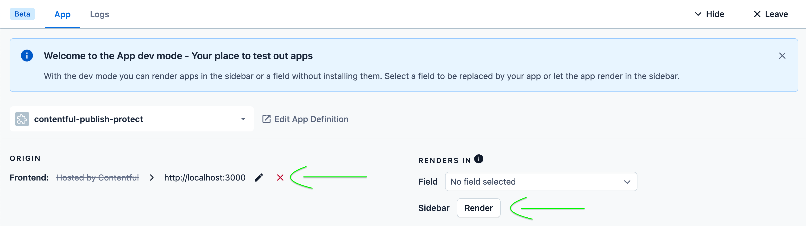

# Contentful Publish Protect

## Getting Started

Enable pnpm using [`corepack`](https://nodejs.org/api/corepack.html) (comes preinstalled with versions of Node `>=16`):

```sh
corepack enable && corepack prepare pnpm@latest --activate
```

Install dependencies

```sh
pnpm install
```

### Local Development

This app has already been installed into Autotelic's "App Testing" org/space. To view changes live on Contentful:

- Go to the App Definition page ([here](https://app.contentful.com/account/organizations/71CxCCp0OX0R8JtqEUQzhO/apps/definitions/5Nn9okXg5hzu3uDFz8OsNL/general))

- Click the "Open in Dev Mode" button

- In dev mode the app's origin can be changed at the bottom of the page in the footer/toolbox - change this to `http://localhost:3000`

- In your terminal, start the dev server (`pnpm start`)

- In the dev mode window navigate to any content entry

- In the dev mode footer/toolbox beneath the "Render's In" section click the sidebar's "Render" button



After following the above steps, any local changes should be reflected in the sidebar app

## App Upload and Installation

On pushes to `main`, a Github workflow will automatically upload this app to our "App Testing" Contentful org/space. All changes should be developed on and implemented in this repo and tested in our "App Testing" space first. If this app needs to be uploaded into another organization, **do not fork this repo into that org**. Instead follow the instructions below

### Adding App to a New Org

1. Create an App Definition

     ```sh
     pnpm create-app-definition
     ```

    - Run the above command from the project root, and then follow the prompts to authenticate and configure the app

      - When asked to "Select where your app can be rendered", select `App configuration screen` and `Entry sidebar`

    - The app definition should now be accessible in the org's "Apps" tab
      - Follow the [Local Development](#local-development) steps above to run the app locally and confirm it all works as expected

    - More details [here](https://www.contentful.com/developers/docs/extensibility/app-framework/create-contentful-app/#creating-an-appdefinition)

2. Build and Upload App

    ```sh
    pnpm build && pnpm upload
    ```

    - Run the above command from the project root, and then follow the prompts to authenticate and upload the app to the desired org

    - More details [here](https://www.contentful.com/developers/docs/extensibility/app-framework/create-contentful-app/#deploy-with-contentful)

3. Install and Configure App

    - In the Contentful UI navigate to the desired space within the org the app was uploaded to, and click the "Apps" tab, then click "Custom Apps"

    - Find the contentful-jsonschema-form app and select the install option.JSON-schema forms can be added to existing JSON field types
